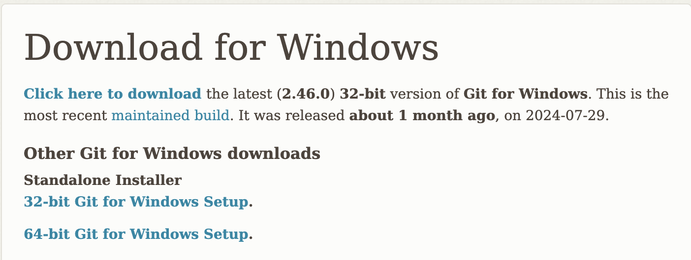
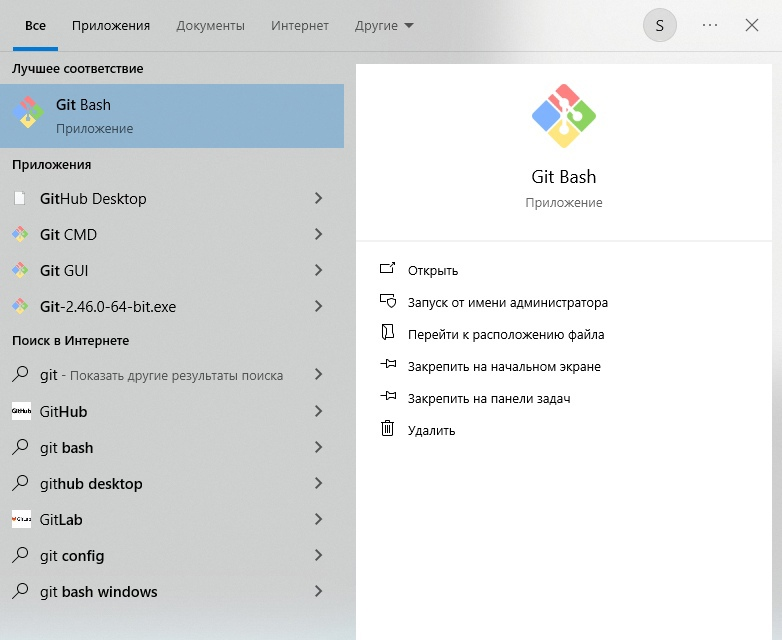
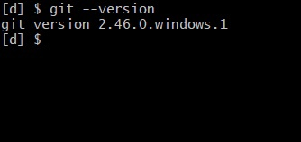
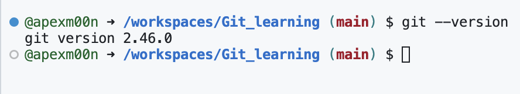

# Установка git

## Установка на Windows

### Установка

Установщик [Git for Windows](https://git-scm.com/download/win)



После скачивания открывается установщик. Вы увидите несколько подсказок для настройки Git для Windows. Если вы не знаете, что выбрать, просто нажмите «Далее», ничего не меняя. Значения по умолчанию разумны и обычно соответствуют вашим требованиям.


### Проверка

Затем после установки необходимо найти в поиске *GitBash* и запустить программу:



Если вы запустите Git Bash и введете `git --version`, вы должны увидеть следующий вывод:



## Установка на macOS

### Установщик
Используйте [установщик](https://git-scm.com/download/mac) с официального сайта.

### Homebrew

Если вы используете `homebrew`, введите команду
```
brew install git
```

### Проверка

Откройте терминал и запустите данную команду:

```
git --version
```

Она выведет версию вашего `git`. Если это произошло, вы успешно его установили.

## Установка на Linux

### Установщик

Если вы используете дистрибутив Linux на базе Debian, выполните в терминале следующую команду:

```
sudo apt install git-all
```

Если ваш дистрибутив Linux основан на RPM, выполните следующую команду:

```
sudo dnf install git-all
```

## Проверка

После установки Git выполните эту команду, чтобы проверить правильность установки:

```
git --version
```

Вы должны увидеть подобное:

