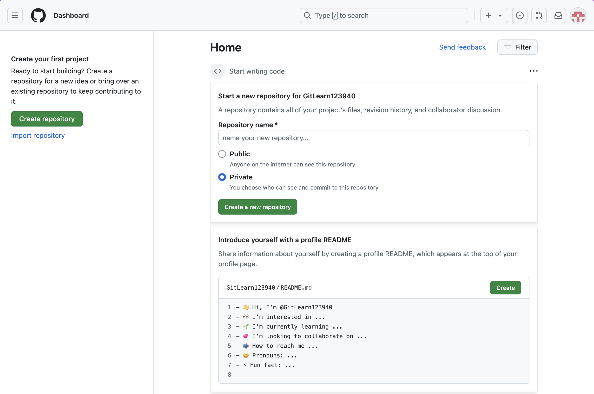

# Регистрация на GitHub

Перейдите на сайт [https://github.com](https://github.com) и зарегистрируетесь:

После выполнения этих шагов вам придется подтвердить свой адрес электронной почты

Теперь вы можете начать использовать GitHub:

