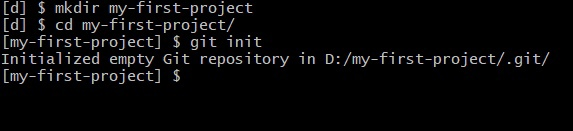
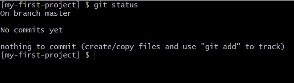

# Как создать первый проект с Git

## Шаг 1: Создание новой папки

1. Откройте терминал или командную строку.

2. Перейдите в директорию, где хотите создать новый проект:

   `cd путь/до/вашей/папки`

3. Создайте новую папку для проекта:  

   `mkdir my-first-project`

4. Перейдите в эту папку:  

   `cd my-first-project`

## Шаг 2: Инициализация Git

1. Внутри новой папки инициализируйте Git, чтобы начать отслеживать изменения:  

   `git init`  

   Это создаст скрытую папку `.git`, которая будет содержать все данные о вашем репозитории.

   

## Шаг 3: Проверка инициализации

1. Чтобы убедиться, что скрытая папка .git была создана, можно воспользоваться следующими способами:

- В терминале введите команду для отображения статуса вашего проекта.

```
git status
```

- При выполнении команды *git status* после инициализации репозитория команда сначала покажет сообщение *"No commits yet"* (нет коммитов) и укажет, что вы находитесь на ветке *"master"*. Это означает, что в репозитории еще нет сохраненных изменений, и вы находитесь на основной ветке.

