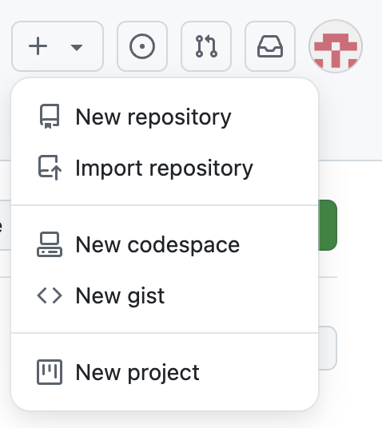
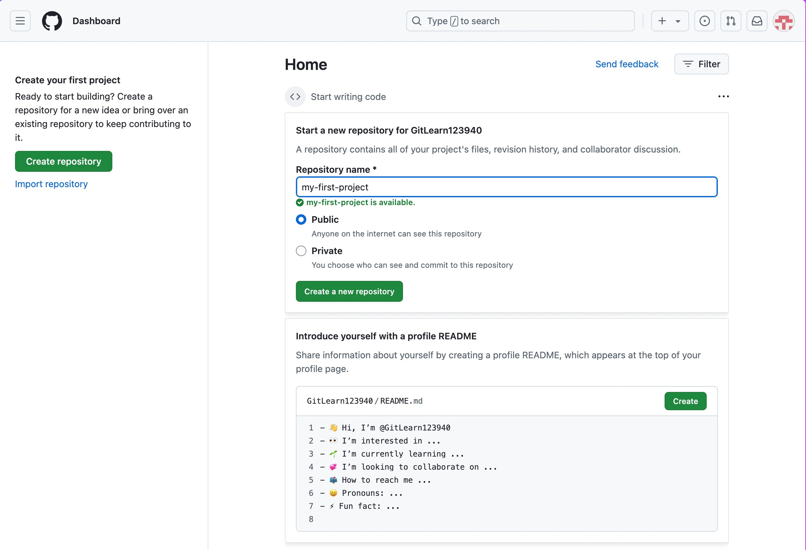
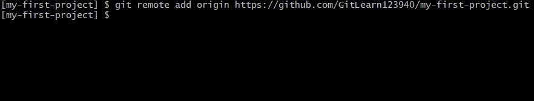
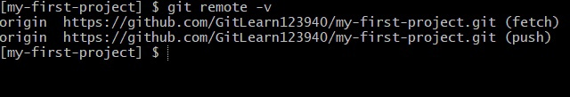

# Подключение к GitHub

Сначала создайте новый репозиторий в GitHub. В правом верхнем углу нажмите на значок "+" и выберите создание нового репозитория:


 
Дайте репозиторию имя:



После создания появится страница для настройки репозитория, обратите внимание, отсюда нам нужна ссылка на репозитрой, теперь возвращаемся в терминал


 
На следующем скриншоте будет показано, как привязать существующий локальный репозиторий к удалённому репозиторию на GitHub, чтобы можно было синхронизировать изменения между ними.

Для этого используйте команду:

```
git remote add origin 'ссылка на ваш репзиторий'
```



Для проверки вы можете посмотреть список своих подключений:

