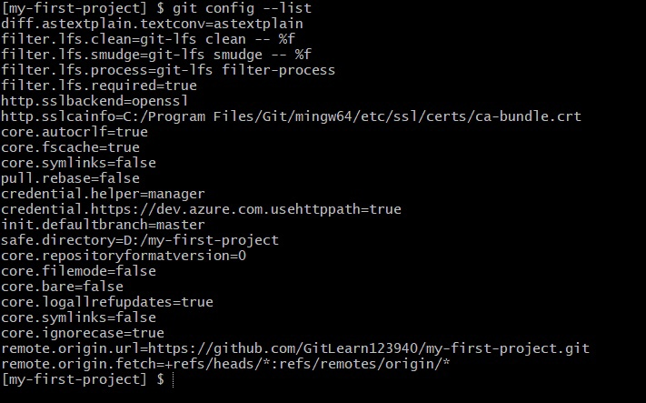
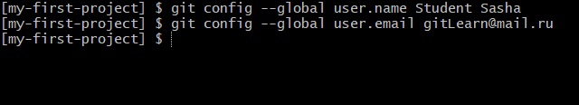

# Конфиг 

Для начала проверьте текущую конфигурацию (ваша конфигурация может отличаться):

Давайте установим наше имя пользователя и адрес электронной почты:

Имя `name` и электронная почта `email` в конфигурации Git необходимы для идентификации автора изменений. Эти данные используются при создании коммитов, чтобы каждый коммит содержал информацию о том, кто его создал. Это важно как для ведения истории изменений, так и для совместной работы в команде.

Вы также можете потенциально установить его только для этого репозитория, убрав флаг `--global`.