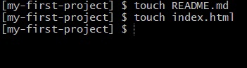
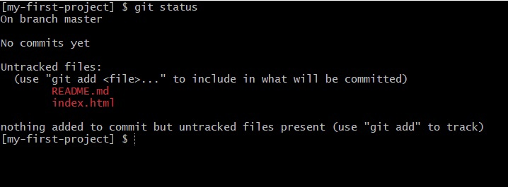
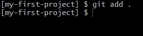
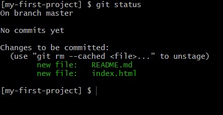
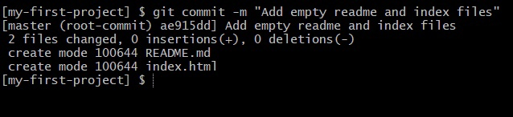
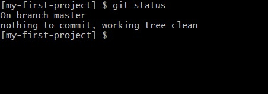

# Добавление коммитов

## 1. Создание файлов

Сначала создайте несколько файлов в вашем репозитории. Вы можете использовать свой любимый текстовый редактор или просто создать пустые файлы через командную строку:

## 2. Проверка статуса репозитория

Вы можете узнать текущее состояние вашего репозитория, выполнив команду `git status`:

## 3. Индексация (staging) файлов для коммита

Чтобы подготовить файлы для коммита, добавьте их в индекс с помощью команды `git add`:

## 4. Повторная проверка статуса

Проверьте статус ещё раз, чтобы убедиться, что файлы добавлены в индекс:

### Пояснение:

**Untracked files** — это файлы, которые ещё не отслеживаются Git, то есть они пока не являются частью вашего репозитория.

**Staged changes** — это изменения, которые вы добавили в индекс, но ещё не зафиксировали (не закоммитили). Файлы в состоянии "staged" готовы для коммита.

## 5. Фиксация изменений (коммит)

Теперь, когда файлы добавлены в индекс, они готовы для коммита. Выполните команду `git commit`, чтобы зафиксировать изменения:

Команда `git commit` используется для фиксации (сохранения) изменений, которые были подготовлены (staged) в индексе. Коммит создаёт снимок текущего состояния проекта и добавляет его в историю изменений репозитория. Обычно коммит сопровождается комментарием (сообщением), которое описывает внесённые изменения.

## 6. Итоговая проверка статуса

После коммита вы можете снова запросить статус, чтобы убедиться, что в репозитории нет непроиндексированных изменений:

