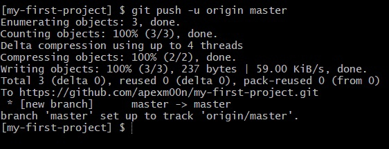

# Отправка (push) в удалённый репозиторий

Теперь отправьте ваш локальный репозиторий в удалённый репозиторий:



Когда вы впервые отправляете данные в удалённый репозиторий, используется следующая команда:

```
git push -u origin master
```

Обратите внимание, как Git сообщает нам, что наша локальная ветка master настроена на отслеживание удаленной ветки master. Это означает, что любые последующие push-запросы больше не нуждаются в части `-u origin master`. Достаточно будет просто `git push`.