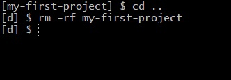
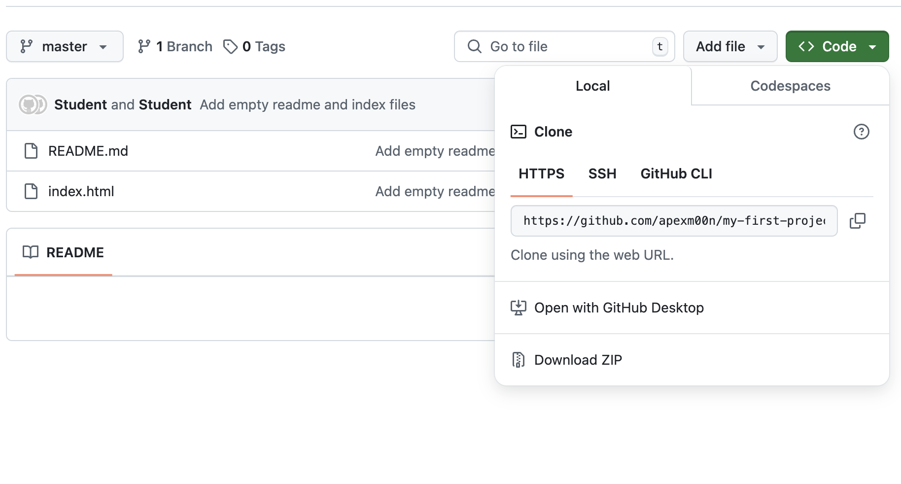
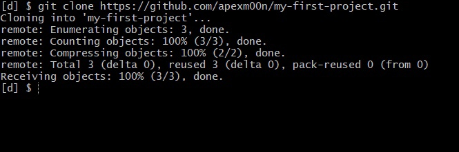

# Клонирование

Клонирование используется для создания локальной копии удалённого репозитория. Она позволяет скопировать весь репозиторий, включая его историю, файлы и структуру, чтобы работать с ним на своём компьютере.

Переместитесь на одну папку вверх и удалите папку на вашем компьютере:

Убедитесь, что папки больше нет, с помощью `ls`.

Теперь клонируйте репозиторий. Правильный URL можно найти в GitHub:

Чтобы клонировать репозиторий, выполните команду `git clone` с этим URL:

