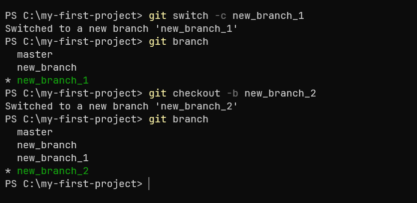

# Работа с ветками

## 1. Что такое ветка
Git хранит всю историю проекта в виде цепочки коммитов, где каждый коммит ссылается на предыдущий.
Ветка - это набор коммитов, которые идут друг за другом. 

Когда вы создаёте новую ветку, Git создаёт новый указатель, который ссылается на текущий коммит. 
Если вы начинаете коммитить в этой ветке, новый коммит будет связан с предыдущим, 
и указатель ветки переместится вперёд, указывая на последний сделанный коммит. 
Таким образом, ветка всегда указывает на самый последний коммит, созданный в ней.

### Пример:

1. Пусть есть основной коммит A, и указатель ветки master ссылается на него.

2. Вы создаёте новую ветку new_branch, и она также будет указывать на коммит A, пока вы не внесёте в неё изменения.

3. Когда вы делаете новый коммит в ветке new_branch, он ссылается на коммит A, 
а указатель ветки new_branch перемещается на новый коммит B.

4. Если вы переключитесь обратно на ветку master и сделаете коммит, то коммит в ветке master будет ссылаться на коммит A, 
а указатель ветки master переместится на этот новый коммит C.

Ветки позволяют вносить изменения, тестировать их, не влияя на основную версию проекта. 
Они помогают организовать работу, особенно в командах, где разные разработчики могут заниматься разными задачами.

Чтобы создать новую ветку используйте команду `git branch <имя_ветки>`.
Для просмотра веток в проекте используйте команду `git branch`. 
Звёздочка будет указывать на ту ветку, на которой вы находитесь в данный момент.

Так же стоит отметить, что Git требует хотя бы одного коммита для создания ветки, 
так как ветка должна указывать на конкретный коммит.

## 2. Переключение между ветками
Когда у вас уже есть несколько веток в вашем репозитории, вы можете переключаться между ними с помощью команд 
`git switch` или `git checkout`. 
Эти команды позволяют вам перейти с одной ветки на другую и работать с соответствующими версиями файлов в этих ветках.

После того как вы перешли в новую ветку, вы можете добавлять, изменять или удалять файлы, создавать коммиты, как обычно. 
Эти изменения будут изолированы в вашей ветке до тех пор, пока вы не объедините её с основной.

### 2.1. Переключение с помощью git switch
Команда `git switch` была добавлена в более новых версиях Git и специально предназначена для переключения между ветками. 
Она более интуитивна и проще в использовании, если вы просто хотите перейти на другую ветку.
Для переключения на существующуюю ветку нужно выполнить команду `git switch <имя_ветки>`.

### 2.2. Переключение с помощью git checkout
Команда `git checkout` более универсальная команда, которая, кроме переключения между ветками, 
также может использоваться для работы с файлами и коммитами. 
Она по-прежнему широко используется, хотя для простого переключения между ветками рекомендуется использовать switch.
Для переключения на существующуюю ветку нужно выполнить команду `git checkout <имя_ветки>`.

### 2.3. Создание веток с помощью git checkout и git switch
Чтобы не делать переключение после создания ветки через git branch <имя_ветки>, 
можно сразу использовать эти команды в виде `git checkout -b <имя_ветки>`
или `git switch -c <имя_ветки>`, после выполнения которых создастся новая ветка и автоматически произойдет переключение на нее.

## 3. Указатель HEAD
`HEAD` — это указатель на коммит, с которым вы работаете в текущий момент.
Обычно `HEAD` указывает на вершину (последний коммит) текущей активной ветки. 

Чтобы посмотреть, куда указывает `HEAD` нужно выполнить команду `git log --oneline --decorate`, 
которая покажет на каком коммите находится `HEAD`, и где он относительно вашей ветки.

Иногда `HEAD` может перестать указывать на ветку и начать указывать напрямую на конкретный коммит - состояние DETACHED. 
Это происходит, когда вы переключаетесь на конкретный коммит вместо ветки с помощью команды `git checkout <commit-hash>`, хэш комита можно посмотреть с помощью команды `git log --oneline`, которая выведет список коммитов для активной ветки с их хэшами.

Добавим коммит и переключимся на предыдущий следующим образом:

В этом случае `HEAD` больше не привязан к ветке и указывает на конкретный коммит. 
Это полезно, когда вы хотите временно посмотреть на прошлую версию кода, но изменения, которые вы сделаете в этом состоянии, не будут автоматически связаны с какой-либо веткой.

Чтобы выйти из состояния DETACHED достаточно обратно переключиться на данную ветку, напрример с помощью `git switch`.

