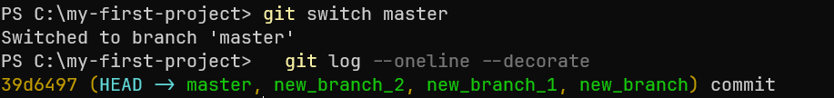
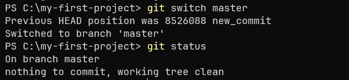

## 1. Указатель HEAD в Git
`HEAD` — это указатель на коммит, с которым вы работаете в текущий момент.
Обычно `HEAD` указывает на вершину (последний коммит) текущей активной ветки. 

Чтобы посмотреть, куда указывает `HEAD` нужно выполнить команду `git log --oneline --decorate`, 
которая покажет на каком коммите находится `HEAD`, и где он относительно вашей ветки.

Иногда `HEAD` может перестать указывать на ветку и начать указывать напрямую на конкретный коммит - состояние DETACHED. 
Это происходит, когда вы переключаетесь на конкретный коммит вместо ветки с помощью команды `git checkout <commit-hash>`, хэш комита для которой можно посмотреть с помощью команды `git log --oneline`, выводящей список коммитов для активной ветки с их хэшами.

Добавим коммит и переключимся на предыдущий коммит следующим образом:

В этом случае `HEAD` больше не привязан к ветке и указывает на конкретный коммит. 
Это полезно, когда вы хотите временно посмотреть на прошлую версию кода, но изменения, которые вы сделаете в этом состоянии, не будут автоматически связаны с какой-либо веткой.

Чтобы выйти из состояния DETACHED достаточно обратно переключиться на данную ветку, например с помощью `git switch`.

