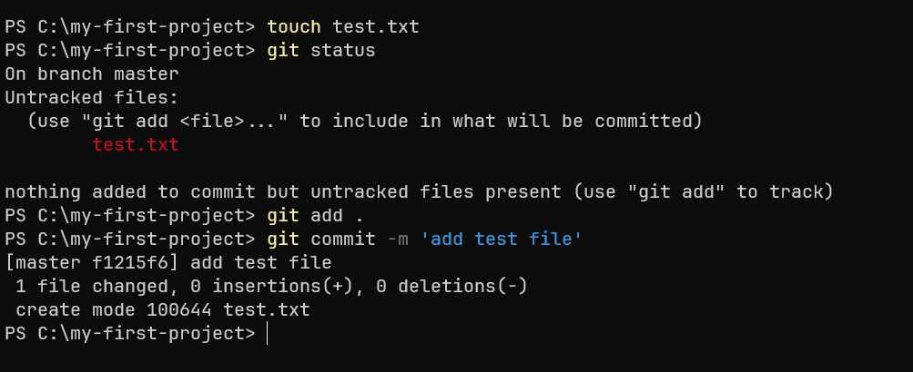
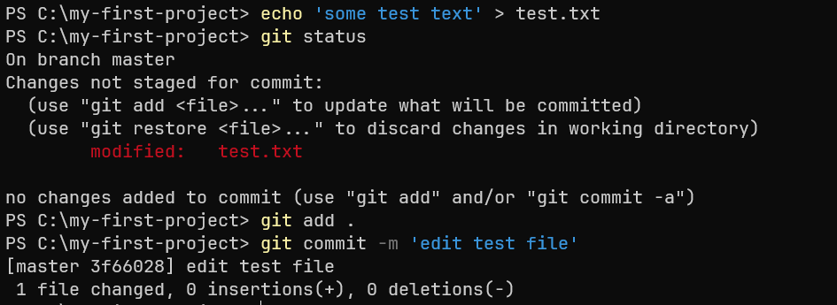
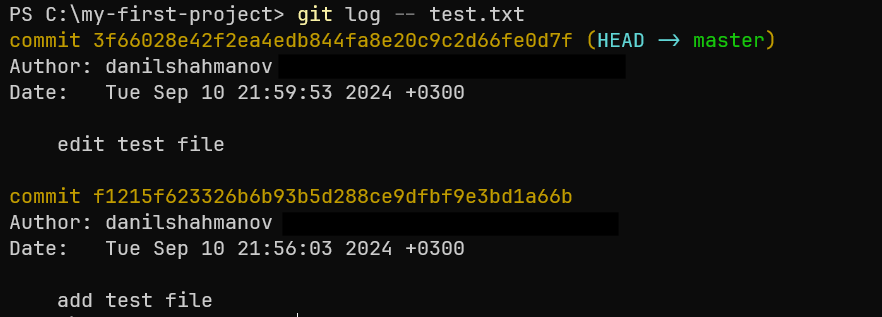
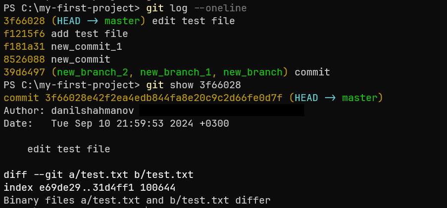
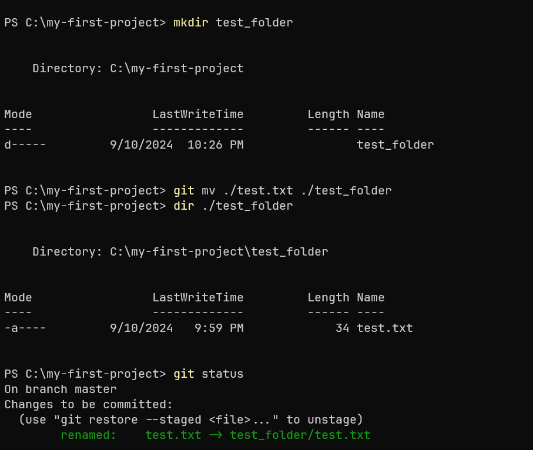
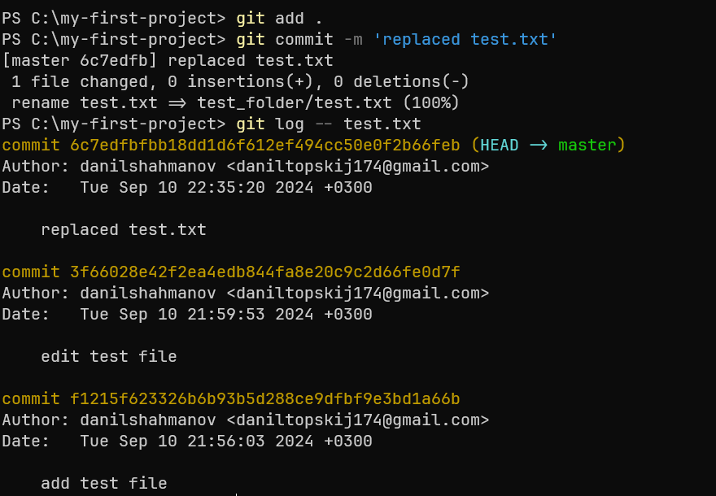
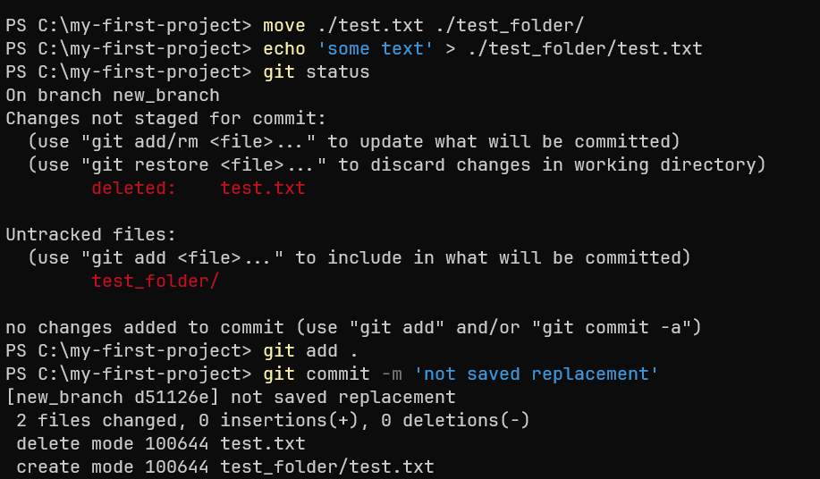

## 1. Просмотр истории файла в Git

Просмотр истории файла — это важная часть работы с Git, позволяющая отслеживать изменения, сделанные с файлом, узнать, кто и когда изменял его, и увидеть старые версии содержимого. В Git есть несколько команд для просмотра истории файла.

Добавим файл `test.txt` и сделаем коммит:

Изменим этот файл и сделаем второй коммит: 

Теперь мы можем посмотреть историю изменений данного файла.
Самый простой способ увидеть историю изменений конкретного файла — это использовать команду `git log --<имя_файла>`. 
Она покажет список всех коммитов, которые затрагивали данный файл: 

## 2. Просмотр информации о коммитах

Команда `git show <хэш_коммита>` выводит подробности одного или нескольких коммитов, такие как изменения файлов, комментарии к коммитам и авторов.
Посмотрим информацию о последнем коммите изменения файла `test.txt`.

## 3. Перемещение и переименование файлов в Git

Переименование или перемещение файла в Git должно быть выполнено правильно, чтобы Git корректно отследил это действие как переименование/перемещение, а не как удаление и создание нового файла. Это важно, потому что в случае неправильного перемещения история изменений файла может быть потеряна, и Git будет считать, что один файл был удалён, а другой создан.

### 3.1. Безопасное перемещение/переименование с помощью git mv

Самый безопасный и правильный способ переименовать или переместить файл — это использовать 
команду `git mv <старое_имя/старый_путь> <новое_имя/новый_путь>`. 
Эта команда сообщает Git, что файл изменил своё местоположение или имя, при этом сохраняя всю историю файла.

Создадим новую папку `test_folder` и переместим туда файл `test_txt` с помощью `git mv`, 
`git status` определит это изменение как переименование файла:

Теперь сделаем коммит этого изменения и убедимся, что история изменений файла сохранилась:

### 3.2. Небезопасное перемещение/переименование

Если вы вручную перемещаете или переименовываете файл (например, с помощью команды `move` в командной строке или через файловый менеджер), 
а затем обновляете индекс с помощью команды `git add`, Git не будет автоматически считать это перемещением или переименованием. 
Он воспримет это как удаление старого файла и создание нового, что приведёт к потере отслеживаемой истории файла.

Перенесем вручную файл `test_txt` из папки `test_folder`, а так же изменим его содержимое (Git может автоматически 
распознать такое небезопасное перемещение, даже если вы не использовали команду git mv. Это происходит благодаря встроенным эвристикам Git, которые сопоставляют содержимое файлов) и сделаем коммит этого изменения:

После такого перемещения, как можно увидеть, история изменений файла не сохранилась:

