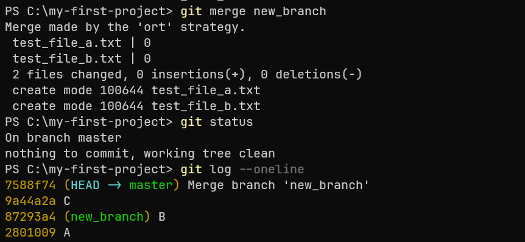
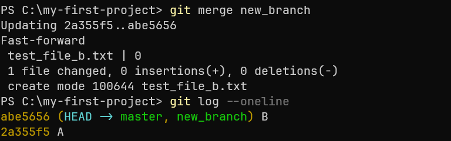
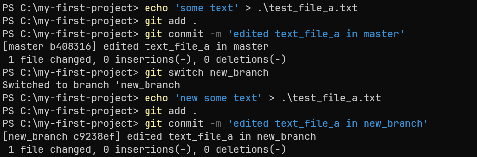
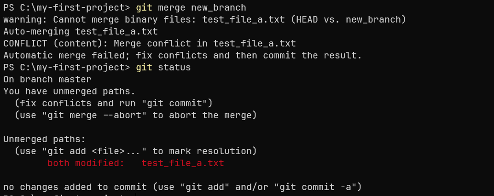
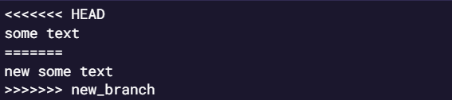
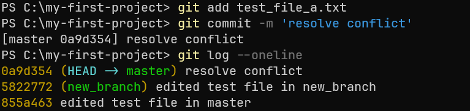

# Слияние веток

## 1. Что такое слияние веток
Слияние веток (merge) в Git — это процесс объединения изменений из одной ветки в другую. 
Этот процесс полезен, когда вы работаете над функциональностью в одной ветке и хотите объединить её изменения с основной веткой. 

Перед выполнением слияния нужно переключиться на ветку, в которую вы хотите включить изменения из другой ветки.
После переключения на целевую ветку можно выполнять команду для слияния `git merge <имя_ветки_с_изменениями>`.

## 2. Слияние без конфликтов
Если в основной ветке были изменения, но они не конфликтуют с изменениями в дочерней ветке, слияние произойдёт автоматически.

Пример:
1. Основная ветка имеет коммит A для создания файла `test_file_a.txt`.
2. На ее основе была создана ветка `new_branch`, в которой был добавлен коммит B для создания файла `test_file_b.txt`.
3. Затем в основной ветке был добавлен коммит C для создания файла `test_file_c.txt`.

При выполнении слияния ветки `new_branch` в основную ветку Git объединяет изменения из коммита B с коммитами A и C. 
Поскольку основная ветка имеет коммит C, будет создан новый коммит слияния.

Коммит слияния - объединяет изменения из обеих веток. 

После выполнения слияния указатель основной ветки перемещается на новый коммит слияния. 
Ветка `new_branch` остаётся на коммите B, если её не удалить.

Пример:
1. Основная ветка имеет коммит A для создания файла `test_file_a.txt`.
2. На ее основе была создана ветка `new_branch`, в которой был добавлен коммит B для создания файла `test_file_b.txt`.

Поскольку в основной ветке нет новых коммитов после создания `new_branch`, 
Git выполнит fast-forward слияние. Указатель основной ветки просто переместится на коммит B.
Ветка `new_branch` также перемещается на коммит B, так как они указывают на один и тот же коммит.

## 3. Конфликты
Когда изменения в ветках пересекаются, Git не сможет автоматически объединить их и попросит вас разрешить конфликты.

Предположим, что файл `test_file_a.txt` был изменён в обеих ветках:

Git покажет файл со статусом `both modified` - это файл с конфликтом.

При слиянии Git добавит специальные маркеры в файл для обозначения конфликтующих изменений:

Для разрешения конфликта нужно отредактировать файл, удалить маркеры и объединить изменения:

Если вы не видите маркеров, но файл отмечен как конфликтующий, возможно, вам придётся выбрать одну из версий или отредактировать файл вручную. 
Чтобы выбрать одну из веток при разрешении конфликта, можно использовать следующие команды:

- `git checkout --ours <файл_с_конфликтом>` - чтобы оставить версию из текущей ветки (ветка в которую вливаются изменения).

- `git checkout --theirs <файл_с_конфликтом>` - чтобы оставить версию из сливаемой ветки используйте команду.

После этого нужно так же объединить изменения.

Если вы начали слияние и обнаружили ошибку, его можно отменить с помощью команды `git merge --abort`.