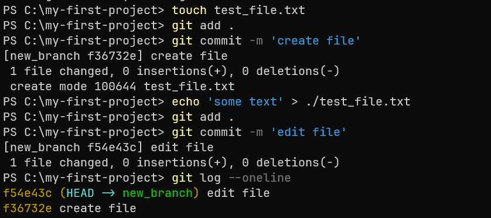
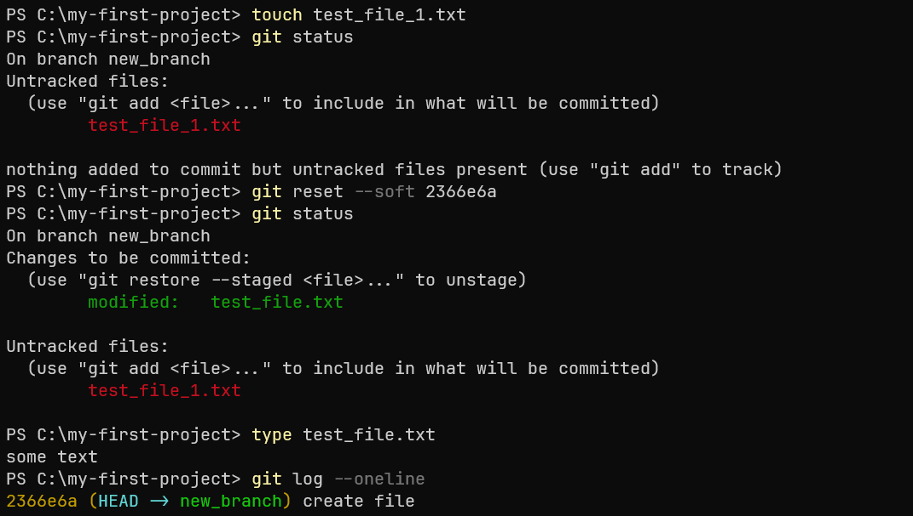
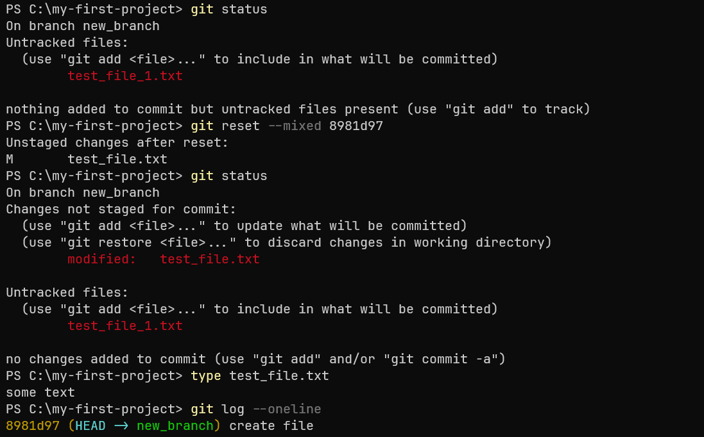
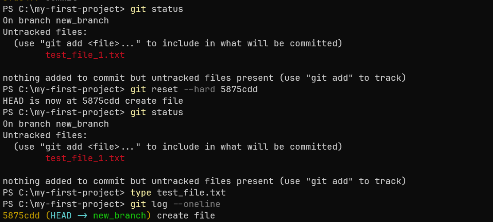

## 1. Переключение между коммитами
`git reset <хэш_коммита>` - команда, которая позволяет перемещать указатель ветки (то есть текущее состояние проекта) назад на определённый коммит. 
История о коммитах после целевого при этом очищается.
В зависимости от флагов команда может влиять на:
- Указатель ветки (где она находится на оси времени).
- Индекс (staging area), который показывает, какие файлы подготовлены для следующего коммита.
- Рабочую директорию — это фактические файлы на вашем компьютере, с которыми вы работаете.

Так же уточним некоторые термины:
- Unstaged files (неподготовленные файлы) — это файлы, которые были изменены, но ещё не добавлены в индекс (staging area) с помощью команды `git add`. Они находятся в рабочей директории и отображаются как изменения, но не будут учтены в следующем коммите, если не подготовлены.
#### Пример: 
Вы изменили файл, но не добавили его в индекс. Git увидит, что файл изменён, но не будет готов его закоммитить.

- Untracked files (неотслеживаемые файлы) — это файлы, которые существуют в вашей рабочей директории, но Git их не отслеживает, потому что они никогда не были добавлены под контроль версий с помощью `git add`. Эти файлы не являются частью предыдущих коммитов и не будут закоммичены, пока вы их явно не добавите.
#### Пример: 
Вы создали новый файл, но не добавили его с помощью `git add`. Git не будет его отслеживать, пока вы не выполните эту команду.

## 2. Флаги для git reset:
### 2.1 Флаг --soft: 
`git reset --soft <хэш_коммита>` - перемещает ветку на указанный коммит, индекс и файлы в рабочей директории остаются неизменными с момента этого коммита.
Используется, когда вы хотите "откатить" коммит, но сохранить файлы для повторной работы с ними.

Сделаем два коммита с созданием и редактированием файла `test_file.txt` и посмотрим историю коммитов: 

Создадим файл `test_file_1.txt` без добавления в индекс, затем выполним команду `git reset` и посмотрим содержимое файла с историей коммитов:

Добавленный файл `test_file_1.txt` сохранил свое состояние untracked, а редактированный `test_file.txt` сохранил свое состояние staged.
Если бы мы добавили `test_file_1.txt` в индекс, то он сохранил бы свое состояние staged.

### 2.2 Флаг --mixed: 
`git reset --mixed <хэш_коммита>` - перемещает ветку на указанный коммит, изменяет состояние файлов из индекса (переводит из staged в unstaged/untracked), файлы в рабочей директории остаются без изменений (untracked). 

Выполним `git reset --mixed <хэш_коммита>` для той же последовательности действий:

Добавленный файл `test_file_1.txt` сохранил свое состояние untracked, а редактированный `test_file.txt` изменил состояние со staged на unstaged.
Если бы мы добавили `test_file_1.txt` в индекс, то он изменил бы свое состояние на untracked.

### 2.3 Флаг --hard: 
`git reset --hard <хэш_коммита>` - перемещает ветку на указанный коммит, удаляет файлы из индекса, файлы в рабочей директории остаются без изменений (untracked). 

Выполним `git reset --hard <хэш_коммита>` для той же последовательности действий:

Добавленный файл `test_file_1.txt` сохранил свое состояние untracked, а изменения `test_file.txt` удалились.
Если бы мы добавили `test_file_1.txt` в индекс, то он бы удалился.
