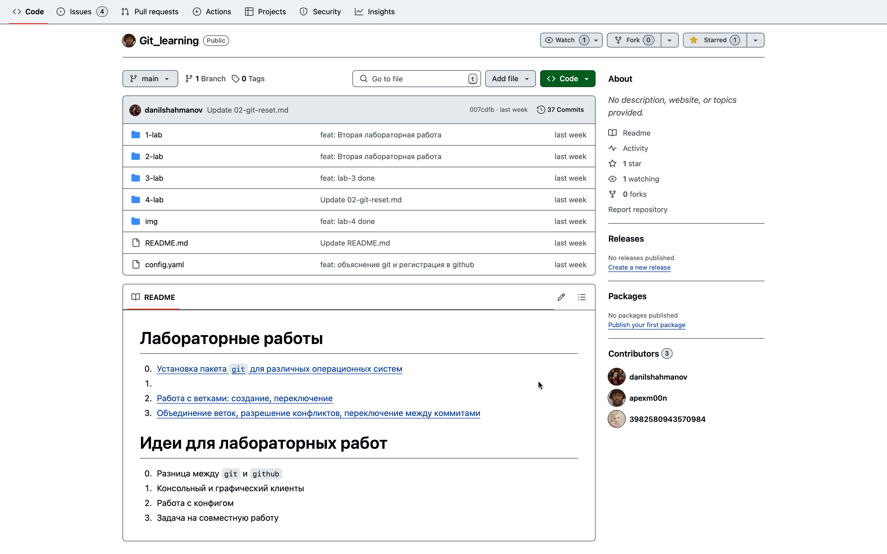

# Github : Вкладки : Code

Вкладка "**Код**", она содержит файлы вашего проекта, в ней вы можете напрямую добавлять файлы в проект (кнопка **Add File**).
Вы можете закреплять (**Pin**) и откреплять (**Unpin**) репозиторий из закреплённых на странице вашего Github профиля.
По умолчанию ваши репозитории уже просматриваются (вы получаете уведомления по ним),
вы можете отписаться(**Unwatch**) от своих проектов и/или подписаться(**Watch**) на чужие, если их разработка в плане кода или итогового продукта вам интересна.

**Fork** – это кнопка позволяет вам продублировать репозиторий на ваш аккаунт и позже, сделав свои _commit_'ы,
добавив или изменив что-то, на этом строится _open source_.

**Star** – эта кнопка лайка.

**Readme** – В низу вкладки расположен блок Readme,
лицо вашего проекта,
где отображается файл Readme.md из корня вашего репозитория,
хорошим тоном является расположение здесь информации о вашем проекте
(также это описание может помочь вам вспомнить,
    что вы за проект такой делали, например, если нужно найти что-то,
    чтобы покрасоваться на собеседовании или
    найти проект для выдачи преподавателю как доказательство того,
        что вы уже делали проект, связанный с его предметом).

