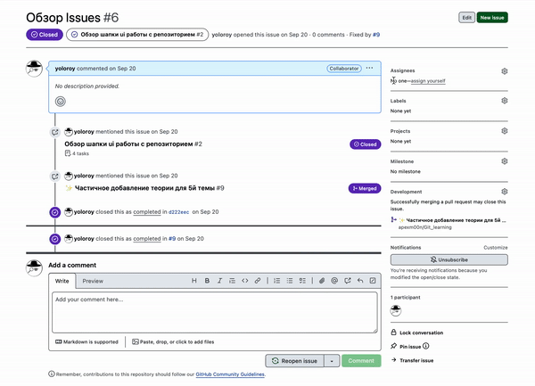

# Github : Вкладки

## Issues

Вкладка Проблемы(или Вопросы), тут можно (**New Issue**) отправлять свои вопросы, рассказывать о проблемах, предлагать что-то новое в проект.
Каждое такое сообщение имеет свой id, в формате #ID (это понадобится позже).

Сам Issue:

Когда вы работаете над новой функциональностью или исправляете что-нибудь,
если вы для организации работы в своём проекте используете Issues,
то вы можете в теле своего commit'а указать, что завершили эту задачу,
делается это добавленем строки с ключевым словом [close / fix / resolve / ...](https://docs.github.com/en/issues/tracking-your-work-with-issues/linking-a-pull-request-to-an-issue#linking-a-pull-request-to-an-issue-using-a-keyword).

**Назначение на Issue:**

Когда вы берёте на себя выполнение задачи, чтобы избежать путаницы в дальнейшем с командой или, чтобы сообщить тем, кого интересует извне, что задачу принялись решать можно указать исполнителя Issue — Assignee:

Также вы можете назначать другим пользователям, работающим над проектом.

https://docs.github.com/en/issues/using-labels-and-milestones-to-track-work/managing-labels
Под назначением на Issue есть ещё Labels — метки, вы можете создать свои метки или использовать стандартные:

|    Label (Метка) | 	Описание                                                                               |
|-----------------:|:----------------------------------------------------------------------------------------|
|              bug | 	Указывает на неожиданную проблему или непреднамеренное поведение                       |
|    documentation | 	Указывает на необходимость улучшения или расширения документации                       |
|        duplicate | 	Указывает на схожие Issue, Pull Request'ы или дискуссии                                |
|      enhancement | 	Указывает на запросы на новую функциональность                                         |
| good first issue | 	Обозначает хорошее первое Issue для новых участников                                   |
|      help wanted | 	Указывает на то, что требуется помощь                                                  |
|          invalid | 	Указывает на то, что Issue, Pull Request или дискуссия больше не актуальна             |
|         question | 	Указывает на то, что Issue, Pull Request или дискуссии требуется больше информации     |
|          wontfix | 	Указывает на то, что работа над Issue, Pull Request или дискуссией не будет продолжена |

## Projects

Инструментарий здесь позволит вам планировать задачи (как они следуют друг за другом, какие сроки, что они из себя представляют: баги, планируемые фичи, и т.д.),
которые можно будет связать с issue, чтобы была синхронизация ваших коммитов и выполненных задач
