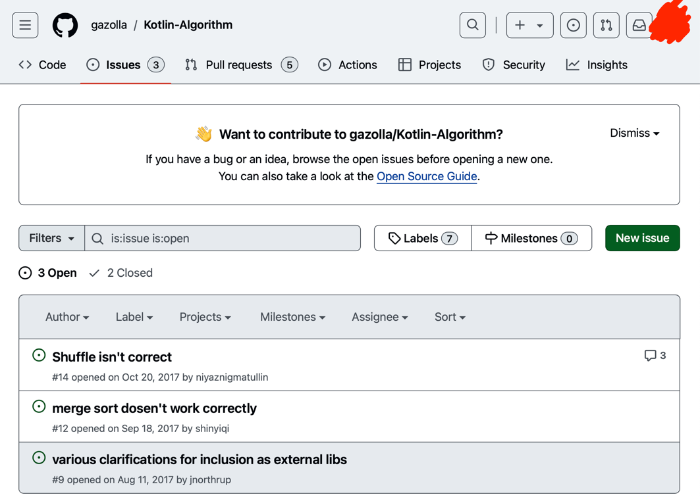
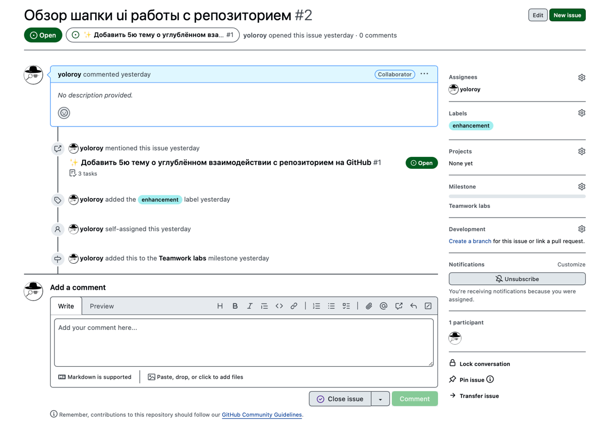
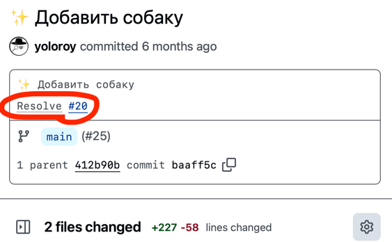

# Github : Вкладки

## Issues

Вкладка Проблемы(или Вопросы), тут можно (**New Issue**) отправлять свои вопросы, рассказывать о проблемах, предлагать что-то новое в проект.
Каждое такое сообщение имеет свой id, в формате #ID (это понадобится позже).

Сам Issue:

Когда вы работаете над новой функциональностью или исправляете что-нибудь,
если вы для организации работы в своём проекте используете Issues,
то вы можете в теле своего commit'а указать, что завершили эту задачу,
делается это добавленем строки с ключевым словом [close / fix / resolve / ...](https://docs.github.com/en/issues/tracking-your-work-with-issues/linking-a-pull-request-to-an-issue#linking-a-pull-request-to-an-issue-using-a-keyword)

## Projects

Инструментарий здесь позволит вам планировать задачи (как они следуют друг за другом, какие сроки, что они из себя представляют: баги, планируемые фичи, и т.д.),
которые можно будет связать с issue, чтобы была синхронизация ваших коммитов и выполненных задач
