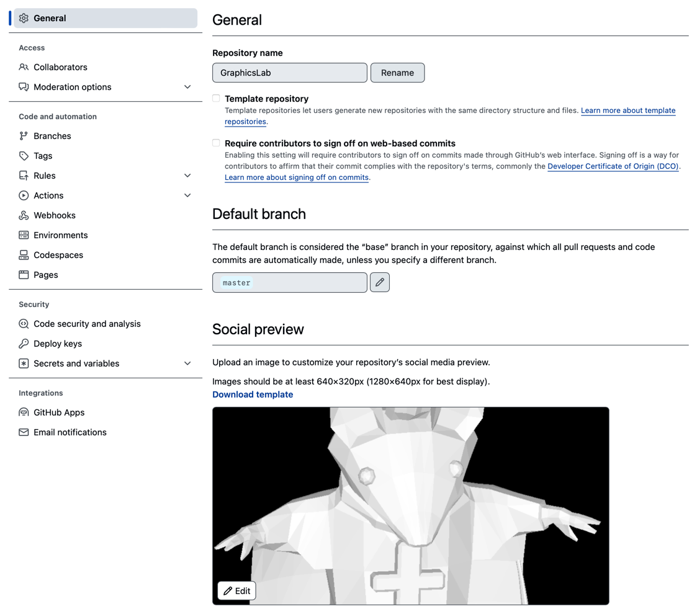
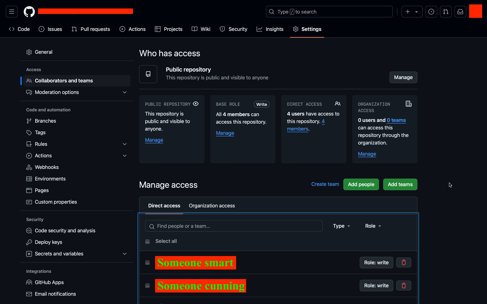

# Github : Вкладки : Settings

## General

В основных настройках можно _менять название_ репозитория, _удалить_, _передать_ его.
Под каждой из настроек есть описание того, что она делает, приводить перевод не имеет смысла, вам тут поможет онлайн-переводчик или уроки английского. 
Также можно изменить видимость репозитория: • Приватный (**private**) репозиторий видите лишь вы и ваши _Collaborators_ (будет рассмотрено дальше); • Публичный (**public**) видим всем, но менять его можете только вы и те, кому вы разрешите во вкладке **Collaborators**.

## Collaborators

Тут вы можете добавлять "коллег" в свой репозиторий, они будут иметь доступ к просмотру репозитория и вы можете настроить, будут ли они иметь право на то чтобы его менять. С настройками в этой вкладке вы можете на скорую руку (хотя и методологически не совсем правильно) начать совместную работу над проектом.

