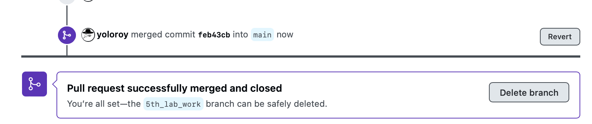

# Github : Вкладки : Pull requests

В разделе Pull requests вам предоставляется инструментарий для организации командной разработки.
Без pull request'ов и без веток ваша команда способна легко и непринуждённо организовать работу,
если ваш код не пересекается и вы готовы решать проблемы слияния (merge'а) локально в текстовом редакторе.
Но что, если вам нужно коллегиально принимать или отклонять код/внесённые изменения? — Тогда вам помогут pull request'ы.

Чтобы отправить pull-request, ваши изменения должны быть сохранены на github'е, корневая ветка, разумеется, не подразумевается.
У вас есть два пути: создание ветки в том же репозитории, для чего вам понадобится либо быть владельцем репозитория,
либо владелец должен дать вам права на создание веток.
Либо же при работе с публичным репозиторием, вы можете выполнить [**fork**](./01-github-tabs-code.md) репозитория.
Тогда из вашего репозитория, при наличии отличных коммитов (вы что-то добавили или оригинальный репозиторий обновился),
у вас над списком файлов появится блок _'This branch is X commit(s) ahead, X commit(s) behind (Оригинальное название репозитория)'_.
Там будут кнопки:
- _'Sync fork'_ — для синхронизации с оригинальным репозиторием,
- _'Contribute'_ — для "внесения своего вклада", т.е. для внесения своих изменений в оригинальный репозиторий.

**Сам процесс работы:**

1. Создание своего ответвления от проекта 
   - Ветка
     - Если у вас есть на то право, то вы можете просто за'push'ить ваш проект в глобальный репозиторий, указав ветку не master/main, а с новым названием
        
   - Fork
2. Отправка своих изменений
   - Появившаяся кнопка над файлами проекта _'Compare & pull request'_ для **ветки**
    
   - Кнопка _'Contribute'_ для **fork'а**
    
3. Так будет отображён ваш Pull request, когда вы его только отправите (**Внимание**, не забудьте именно его отправить, а не просто открыть окно отправки):
    
4. Ваша команда может покритиковать, решить проблемы слияния (merge'а), просто написать комментарии:
    
    ...
    
5. И в конце настанет время слияния веток. Eсли будет конфликт, то github предоставит окно для его решения. Сейчас же будет рассмотрен случай успешного слияния:
    
    ...
    
