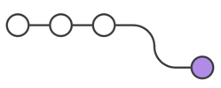

# Git : Методологии : Feature Branch Workflow

> Source(Atlassian) : https://www.atlassian.com/git/tutorials/comparing-workflows/feature-branch-workflow
>
> Эта статья является переводом статьи Atlassian

Основная идея, стоящая за Feature Branch Workflow состоит в том, что разработка функционала должна происходить в отдельной ветке вместо основной (`main`/`master`).
Такое разделение упрощает работу множества разработчиков над какой-либо задачей, без взаимодействия с основной кодовой базой.
Также из этого следует, что в основной (`main`/`master`) ветке никогда не будет нерабочего/сломанного кода, что предоставляет преимуществом при продолжительной разработке.

Выделение разработки функционала также делает возможным использование pull request'ов, чтобы запустить процесс дискуссии о ветке.
Они дают другим разработчикам возможность отбраковать фичу до того как она будет внедрена в проект.
Или, если вы застряли во время решения задачи, вы можете отправить pull request, попросив предложений от ваших коллег.
Смысл в том, что pull request'ы предоставляют удобный в использовании функционал для вашей команды для обсуждения работы друг друга.

Git Feature Branch Workflow — это легко комбинируемая методология, которая может быть использована другими высокоуровневыми методологиями git'а.
Мы рассматривали и другие git методологии на [Обзорной странице](./00-git-workflows-intro.md) [(оригинал)](https://www.atlassian.com/git/tutorials/comparing-workflows).
Эта модель концентрируется на ветках, т.е. представляет собой принципы организации и создания веток.
Другие момодели больше фокусируются на репозитории, эта же может быть внедрена в другие методологии.
[Gitflow](https://www.atlassian.com/git/tutorials/comparing-workflows/gitflow-workflow) и [Git Forking Workflows](https://www.atlassian.com/git/tutorials/comparing-workflows/forking-workflow)
часто используют Git Feature Branch Workflow в отношении к их работе с ветками.

---

## Как это устроено

Feature Branch Workflow предполагает, что центральный репозиторий и ветка `main` представляет собой официальную историю проекта.
Вместо того чтобы слать commit'ы напрямую в `main` ветку, разработчики создают новою ветку для каждой новой задачи.
Названия feature-веток должны описывать, что в них делается, например: animated-menu-items (анимированны-элементы-меню) или issue-#1061 (разрешение issue #1061).
Git технически не различает ветку `main` и другие ветки, так что разработчики могут редактировать, хранить и commit'ить изменения в feature-ветку.

Плюс, feature-ветки можно (и должно) push'ить в центральный репозиторий.
Это даёт возможность делиться функционалом с другими разработчиками не затрагивая основной код.
Т.к. `main` — это единственная "особенная" ветка, хранение множества feature-веток в центральном репозитории не представляет никаких проблем.
Также это удобный способ все резервно хранить локальные изменения.
Далее будет описание жизненного цикла feature-ветки.

### Начнём с main-ветки

Все feature-ветки начинаются с крайней версии main-ветки.

```git
git checkout main
git fetch origin
git reset --hard origin/main
```

### Создайте репозиторий

Это переключает репозиторий на основную ветку, извлекает последние commit'ы и сбрасывает локальную копию main репозитория в соответствии с последней версией.

### Создайте новую ветку

Используйте отдельную ветку для каждой фичи или issue, над которыми вы работаете.
После создание ветки, перейдите на неё, чтобы все локальные изменения были в этой ветке.

```git
git checkout -b new-feature
```

Так вы создаёте ветку с названием new-feature, флаг `-b` создаёт ветку, если таковой ещё не существовало.

### Обновление, добавление, фиксирование и отправка изменений

С этой веткой вы можете работать в этой ветке, так же как и обычно, делая столько commit'ов, сколько необходимо.
Когда всё будет готово, за'push'те ваши commit'ы, обновляя вашу feature-ветку.

```git
git status
git add <Ваш.файл>
git commit
```

### Отправка работы на удалённый репозиторий

Отправка (push) вашей feature-ветки в центральный репозиторий является хорошей идеей, так вы создаёте удобный бэкап, при взаимодействии с другими разработчиками, вы дадите им доступ к просмотру commit'ов в новой ветке.

```git
git push -u origin new-feature
```

Эта команда отправляет (push'ит) new-feature в центральный репозиторий (origin), флаг `-u` добавляет её как удалённую отслеживаемую ветку.
После установки отслеживаемой ветки, `git push` может быть вызван без каких либо параметров для отправки (push'а) изменений в ветке new-feature в центральный репозиторий.
Чтобы получить фидбек, создайте pull request в своём удалённом репозитории (bitbicket, github, иные).
Теперь вы сможете вместе удостовериться, что всё готово и правильно до слияния.

### Получение фидбека

Сокомандники комментируют и оценивают. Исправьте проблемы локально, за'commit'те изменения локально и за'push'те их, pull request обновится с ними.


### Merge your pull request

Прежде чем вы сольётесь, вы можете разрешить конфликты слияния (merge'а), если уже были сделаны изменения в репозитории.
Когда ваш pull request принят и не имеет конфликтов, вы можете отправить свой код в `main` ветку.

## Pull requests

> TODO полный перевод
> 
> см. [Занятие 5](../5-lab/04-github-tabs-pull-requests.md)

## Пример

### Мария начинает делать новую фичу



Прежде чем приступить к разработке нового функционала, Мария должна создать отдельную ветку, чтобы работать в ней:

```git
git checkout -b marys-feature main
```

Она создала и перешла на ветку `marys-feature`, флаг `-b` говорит git'у создать ветку, если её ещё не существует.
В этой ветке, Мария производит свою работу как обычно.

### Мария уходит на перерыв

Сутра Мария добавляет несколько commit'ов.
Прежде чем она отправится на перерыв, она отправляет свою ветку в центральный репозиторий, это служит и бэкапом, и, если она работает в команде, то её коллеги получат доступ к её работе.

```git
git push -u origin marys-feature
```

Эта команда отправляет `marys-feature` в центральный репозиторий (origin), а флаг `-u` устанавливает удалённую отслеживаемую ветку.
После установки отслеживаемой ветки, Мария сможет вызывать `git push` без дополнительных параметров в будущем.

### Мария закрывает свою задачу

Когда Мария возвращается с перерыва, она завершает свою работу, прежде чем сделать pull request, она отправляет свои изменения.

```git
git push
```

### Билл получает pull request

Билл получает pull request и смотрит на `marys-feature`.
Он предлагает несколько изменений перед внедрением изменений в основной код, он и Мария ведут обсуждение в pull request'е

### Мария вносит правки

Мария вносит правки, push'ит их, команда Билл по ходу комментирует их в pull request'е.

Если нужно, Билл может скачать (за'pull'ить) изменения из `marys-feature` в свой локальный репозиторий и продолжить работу сам.
Сделанные изменения тоже появятся в pull request'е.

### Мария публикует свои изменения

Как Билл примет pull request, кому-либо нужно будет слить (с'merge'ить) изменения в стабильную часть проекта (это может осуществить как Билл, так и Мария):

```git
git checkout main
git pull
git pull origin marys-feature
git push
```

(Можно осуществить и через онлайн интерфейс)

## Заключение

Здесь мы обсудили Git Feature Branch Workflow.
Эта методология помогает в организации веток в связи с задачами бизнес-требований.
Другие методологии, такие как Git Forking Workflow и Gitflow Workflow сфокусированы на репозитории и могут включать Git Feature Branch Workflow.

Использование `git rebase` во время этапа review и слияния feature-веток могут составить последовательную историю слияний в Git.
Feature Branching Model — удобный инструмент для побуждения сотрудничества в команде.
